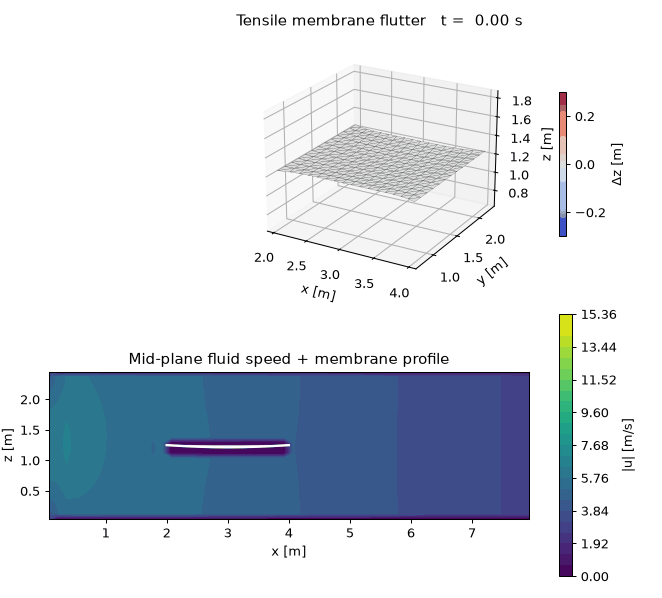

# Tensile Membrane Structures under Fluid Flow (FSI)

Python package for **fluid–structure interaction** of prestressed tensile membranes
(sails, canopies, fabric roofs) in incompressible flow.

This folder is self-contained and sits alongside the existing LES / PISO notebooks
in the repository root.



*Channel flow (LES) past a light tensile membrane with a gusty inflow — the
membrane flutters under the unsteady aerodynamic lift. Generated with
`examples/run_flutter_gif.py`.*

## What’s inside

```
tensile_membrane_fsi/
├── config/default.yaml          # physics & numerics
├── config/flutter.yaml          # flutter demo: soft membrane + gusty inflow
├── main.py                      # full FSI entry point
├── requirements.txt
├── media/membrane_flutter.gif   # pre-rendered flutter animation
├── src/
│   ├── membrane/                # CST membrane FEM + prestress / dynamics
│   ├── fluid/                   # Cartesian NS + Smagorinsky LES + immersed membrane
│   ├── fsi/                     # partitioned serial-staggered coupling
│   └── utils/                   # YAML I/O, VTK/NPZ, plots, GIF animation
├── quasi_static/                # quasi-static FSI: Updated Weight Method ↔ PISO/LES
│   ├── uwm.py                   # UWM form-finding (prestress + fluid loads)
│   ├── coupling.py              # outer iterative partitioned loop
│   ├── main.py
│   ├── config/quasi_static.yaml
│   └── tests/
├── examples/
│   ├── run_membrane_only.py     # structure-only gust response
│   ├── run_fsi_demo.py          # coarse coupled demo
│   ├── run_flutter_gif.py       # flow past membrane → flutter GIF
│   └── generate_gmsh_channel.py # optional unstructured channel+membrane mesh
├── tests/
└── output/                      # created at runtime
```

## Physics model

| Part | Model |
|------|--------|
| Membrane (transient) | Constant-strain triangles, isotropic prestress + plane-stress elasticity, explicit central-difference dynamics |
| Membrane (quasi-static) | Updated Weight Method form updates under prestress + fluid nodal loads (no mass/damping) |
| Fluid | 3D incompressible Navier–Stokes: Smagorinsky LES discretisation, then Issa **PISO** (predictor + N pressure correctors) |
| Coupling | Serial staggered: fluid → dynamic pressure loads → membrane → immersed-boundary update |
| IB | Thin-band immersed membrane in the Cartesian fluid grid |

## Quick start

```bash
cd tensile_membrane_fsi
pip install -r requirements.txt

# fast smoke demo (~coarse mesh, short time)
python main.py --quick

# membrane-only form-finding + gust
python examples/run_membrane_only.py

# coarse FSI demo
python examples/run_fsi_demo.py

# flow past the membrane → flutter animation (writes output/flutter/membrane_flutter.gif)
python examples/run_flutter_gif.py

# full run from config
python main.py -c config/default.yaml

# quasi-static FSI: UWM form updates + PISO/LES fluid
python quasi_static/main.py --quick
python quasi_static/main.py -c quasi_static/config/quasi_static.yaml

# quasi-static GIF over a time interval → quasi_static/output/membrane_quasi_static.gif
python quasi_static/run_gif.py --quick
python quasi_static/run_gif.py --t-end 1.0

# tests
python -m pytest tests/ quasi_static/tests -q
```

## Configure a case

Edit `config/default.yaml`:

- `membrane.*` — span, mesh density, fabric E / ν / thickness / prestress, fixed edges
- `fluid.*` — channel size, resolution, ρ, ν, inlet speed, membrane placement;
  optional `gust_amp` / `gust_freq` for an unsteady gusty inflow and `u_clip`
  for the velocity sanitizer
- `fsi.*` — under-relaxation, sub-iterations, load model (`dynamic_pressure`,
  `pressure_jump`, or `interpolated_field`)
- `les.*` — Smagorinsky `Cs`
- `time.*` — `dt`, `t_end`

For flutter, use `config/flutter.yaml`: a light, softly prestressed fabric
clamped on all four edges, with near-zero structural damping, a gusty inflow,
and the `pressure_jump` load model, which computes the unsteady lift from the
pressure difference sampled on the two sides of the membrane.

## Outputs

Written under `output/` (or `simulation.output_dir`):

- `snapshot_XXXXXX.npz` — membrane nodes + fluid fields
- `membrane_XXXXXX.vtk` — open in ParaView
- `slice_XXXXXX.png` — mid-plane |u| with membrane outline
- `history.csv` / `history.png` — displacement, KE, CFL, FSI residual
- `membrane_flutter.gif` — animated flutter (from `examples/run_flutter_gif.py`)

The results of the 6 s flutter run (`examples/run_flutter_gif.py` with
`config/flutter.yaml`) are committed under `output/flutter/`: 11 NPZ
snapshots and membrane VTK files (every 0.6 s), mid-plane slice plots,
the displacement/energy history, the final membrane shape, and the GIF.

## Notes / limits

- The built-in fluid solver uses a **uniform Cartesian grid** with an immersed membrane.
  For production unstructured LES, generate a Gmsh mesh with
  `examples/generate_gmsh_channel.py` and couple externally to your PISO / OpenFOAM pipeline.
- Explicit membrane time steps are limited by the membrane wave speed; reduce `dt` or
  prestress / E if the run becomes unstable.
- Load transfer uses a dynamic-pressure / incidence model suitable for teaching and
  prototyping; replace `src/fsi/load_transfer.py` for higher-fidelity pressure mapping.
